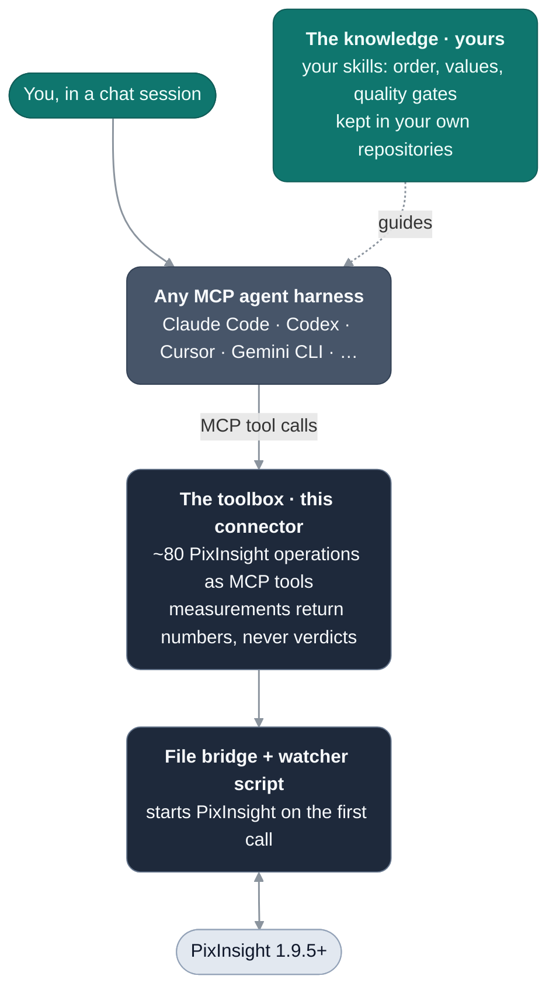

# PixInsight Connector

An MCP connector that lets any AI agent operate [PixInsight](https://pixinsight.com): about 80 PixInsight
operations as tools, for chat sessions and the skills that guide them. **New here? Start with the [Quick start](QUICKSTART.md).**

> Community project, not affiliated with or endorsed by Pleiades Astrophoto. PixInsight® is a registered
> trademark of Pleiades Astrophoto S.L.

## The principle: a toolbox, not a pipeline

The connector knows how to **operate** PixInsight, never what makes a **good picture**. No pipeline, no
ordering, no recommended values, no verdicts: every tool takes the values that shape the image as inputs,
and every measurement returns numbers. The knowledge (which tools, in what order, with which values, what
counts as good enough) lives in **skills**: markdown in your own repositories, public or private.



## Install

Needs Node 22+ and PixInsight 1.9.5+. The same three steps work whether you or your agent runs them.

**1. Install the connector** from npm:

```sh
npm install -g pixinsight-connector
```

**2. Register it** with your agent harness as the MCP server `pixinsight`. Claude Code:

```sh
claude mcp add -s user pixinsight -- pixinsight-connector
```

Any harness configured with an `mcpServers` JSON file (Cursor, Windsurf, Gemini CLI, Claude Desktop, Cline, Kiro):

```json
{ "mcpServers": { "pixinsight": { "command": "pixinsight-connector" } } }
```

Codex, OpenCode, VS Code and Zed use other shapes; each one, and where its file lives: [docs/setup.md](docs/setup.md).

**3. Check the machine:**

```sh
pixinsight-connector doctor
```

PixInsight and its watcher script start on the first tool call; there is nothing else to launch. Upgrade with
`npm install -g pixinsight-connector@latest`. Without installing, register `npx -y pixinsight-connector` as the
command instead (npx fetches it from npm, so the first start needs the network). From pixinsight-mcp 1.x: point
your `pixinsight` entry at `pixinsight-connector` (not a second server) and `npm uninstall -g pixinsight-mcp`.

## Where files go

The tools work in a target folder: the one `set_workspace` names, else `PIXINSIGHT_CONNECTOR_WORKSPACE`, else the
folder the harness started in. The connector writes only `<target>/agentic/` (scratch, the bridge, call logs) and
`<target>/output/`, never your home folder. Details and every environment variable: [docs/setup.md](docs/setup.md).

## Tools, packs and skills

- **Tools:** 78, grouped as images, processes, channels, tone, detail, masks, stars, narrowband, astrometry,
  measurement, preview, PJSR execution, introspection and session. Full list: [docs/tools.md](docs/tools.md).
- **Skills** hold the technique. Companion skills (environment preflight, dataset intake, a basic LRGB flow): [pixinsight-connector-skills](https://github.com/mxcoppell/pixinsight-connector-skills). Have one that works? Add it to [COMMUNITY.md](COMMUNITY.md).
- **Packs** are ES modules that add or replace tools at startup, listed in `PIXINSIGHT_CONNECTOR_PACKS`. A pack is
  arbitrary code running with your privileges; only packs you configure load. See
  [CONTRIBUTING.md](CONTRIBUTING.md#developing-a-pack).
- **Models:** any with vision and reliable tool calling. Start with a Sonnet-class model (Claude Sonnet 5, GPT-6 Sol,
  Gemini 3.8 Flash), then try cheaper ones (GPT-6 Luna, GLM-5.3-Flash, DeepSeek V4.1 Flash): prices and the list are in [docs/setup.md](docs/setup.md#models).

## Contributing

A PixInsight capability with no tool yet is one module in `src/tools/`, no registry: [CONTRIBUTING.md](CONTRIBUTING.md).
Humans and agents are both welcome; `npm test` needs no PixInsight.

<!-- crossplatform:start -->
## Cross-platform

macOS, Windows and Linux are all first-class, for running this connector and for developing it.
A change that works on one OS and breaks another is a bug, not a limitation.

- **No shell pipelines.** No `ps`, `grep`, `awk`, `wc`, `df` or `&&` in `src/` or in npm scripts.
  OS-specific behaviour goes behind `src/platform.mjs` (paths) or `src/process-probe.mjs` (process
  inspection), one implementation per OS.
- **No POSIX path literals.** Use `path.join`. Use forward slashes only when handing a path to
  PixInsight, which accepts them everywhere.
- **CI runs the full suite on Linux, macOS and Windows.** Green on one is not green.
- **Degrade, never fail.** If an OS cannot supply something optional — a memory reading, a process
  start time — carry on without it. Never report it as a crash.
- **Overrides always win:** `PIXINSIGHT_BIN` for the executable, `PIXINSIGHT_DIR` for the install root.

Tests need no PixInsight and no astronomy software, so you can develop on any of the three.
<!-- crossplatform:end -->

## Troubleshooting

Run `pixinsight-connector doctor` first. Common symptoms and fixes: [docs/troubleshooting.md](docs/troubleshooting.md).

## Credit and license

This project began as [aescaffre/pixinsight-mcp](https://github.com/aescaffre/pixinsight-mcp) by Alain Escaffre;
parts of the original file bridge and watcher script remain. MIT licensed: see [LICENSE](LICENSE).
